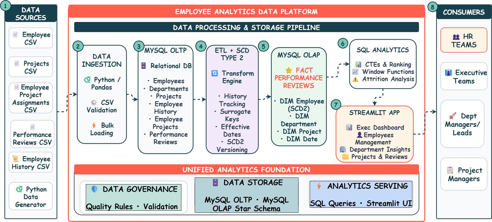
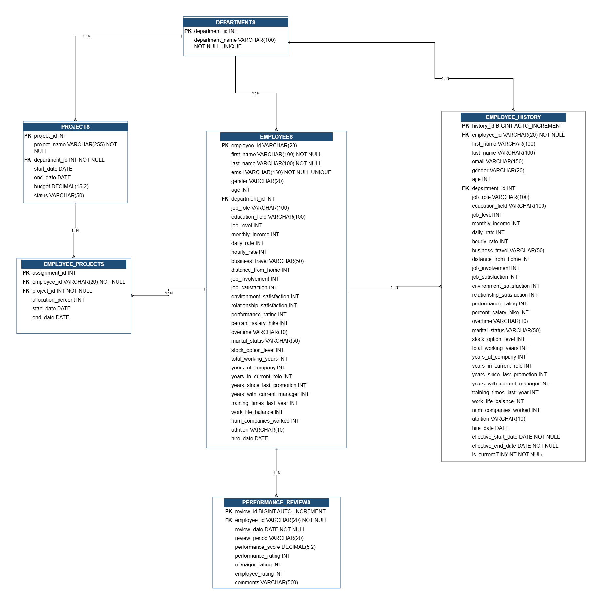
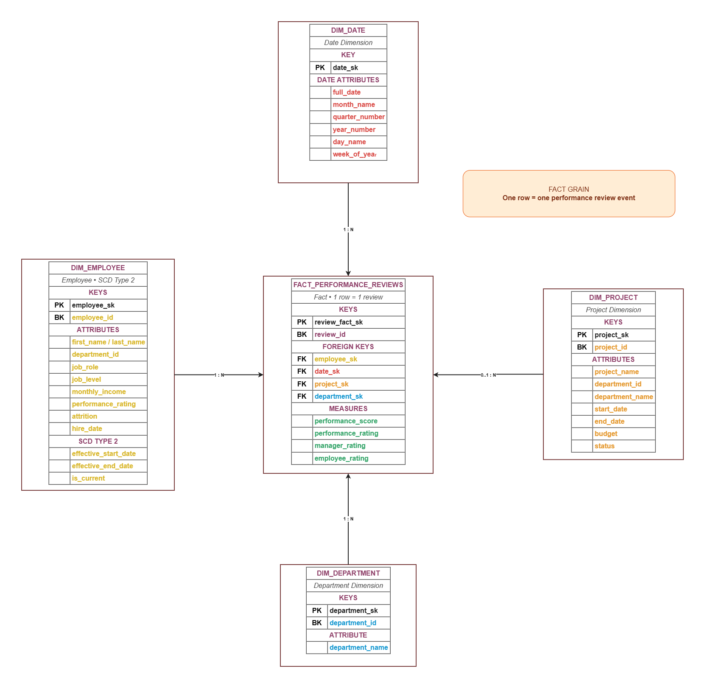

# Employee Analytics Data Platform

## Project Team

- **Ashitosh Bachute**
- **Shashikant More**
- **Ujjwal Srivastava**

---

## 1. Project Overview

The **Employee Analytics Data Platform** is an end-to-end employee data warehousing and analytics system.

The project combines a **MySQL OLTP database, ETL processing, SCD Type 2 historical tracking, OLAP star schema, advanced SQL analytics, Python OOP, and Streamlit**.

### Main Features

- Employee onboarding
- Employee information management
- Department updates
- SCD Type 2 employee history
- Project creation
- Employee-project assignments
- Performance review management
- Employee 360 view
- Performance analytics
- Department performance analysis
- Employee ranking
- Project workload analysis
- Data validation

### Data Flow

```text
Data Sources
     ↓
Python / Pandas Data Processing
     ↓
MySQL OLTP
     ↓
ETL + SCD Type 2
     ↓
MySQL OLAP Star Schema
     ↓
SQL Analytics
     ↓
Python Manager Layer
     ↓
Streamlit Application
     ↓
HR / Executives / Managers
```

---

# 2. Architecture

The system follows a layered data warehouse architecture.



### Architecture Components

**Data Sources**
- Employee data
- Project data
- Employee-project assignments
- Performance reviews
- Employee history
- Python-generated data

**Data Ingestion**
- Python
- Pandas
- Data validation
- Bulk data loading

**OLTP**
- Stores operational employee and project information.

**ETL + SCD Type 2**
- Transforms operational data into analytical data.
- Maintains employee historical versions.
- Generates and manages surrogate keys.
- Handles effective dates.

**OLAP**
- Stores analytical data using a star schema.

**SQL Analytics**
- CTEs
- Window functions
- Performance analysis
- Employee rankings
- Project workload analysis
- Year-over-year analysis

**Streamlit**
- Provides the user interface for data entry and analytics.

---

# 3. Database Design

The project contains both an **OLTP database** and an **OLAP data warehouse**.

## 3.1 OLTP Database

The operational database contains:

```text
departments
employees
employee_history
projects
employee_projects
performance_reviews
```

The OLTP database supports transactional operations such as:

- Adding employees
- Updating departments
- Creating projects
- Assigning employees to projects
- Adding performance reviews

### OLTP ER Diagram

The project includes a separate **editable OLTP ER diagram** showing the relationships between the operational tables.



---

## 3.2 OLAP Data Warehouse

The analytical database follows a **Star Schema**.

### Fact Table

```text
fact_performance_reviews
```

### Dimension Tables

```text
dim_employee
dim_department
dim_project
dim_date
```

### OLAP Star Schema

```text
                  dim_employee
                       |
                       |
dim_department — fact_performance_reviews — dim_project
                       |
                       |
                    dim_date
```

The project includes a separate **editable OLAP star-schema diagram** representing these relationships.




---

# 4. SCD Type 2

The employee dimension implements **Slowly Changing Dimension Type 2**.

When an employee changes department, the previous record is preserved and a new version is created.

```text
Current Employee Version
          ↓
Close Previous Version
          ↓
Create New Version
          ↓
Mark New Version as Current
```

The dimension uses:

- `employee_sk`
- `effective_start_date`
- `effective_end_date`
- `is_current`

This allows historical employee information to be retained for analytical reporting.

---

# 5. Data Scale

The project uses large-scale data for demonstrating the data warehouse.

| Dataset | Records |
|---|---:|
| Employees | 100,000 |
| Employee History | 117,484 |
| Departments | 3 |
| Projects | 500 |
| Employee Project Assignments | 200,000 |
| Performance Reviews | 300,000 |
| Performance Facts | 300,000 |

---

# 6. Project Structure

```text
employee-analytics-DW/
│
├── db/
│   └── db_manager.py
│
├── models/
│   ├── employee.py
│   ├── project.py
│   └── review.py
│
├── managers/
│   ├── employee_manager.py
│   ├── analytics_manager.py
│   ├── project_manager.py
│   └── review_manager.py
│
├── etl/
│   ├── inspect_data.py
│   ├── synthesizer.py
│   ├── generate_related_data.py
│   ├── generate_scd2.py
│   └── generate_performance_reviews.py
│
├── pages/
│   ├── dashboard.py
│   ├── onboarding.py
│   ├── projects.py
│   ├── reviews.py
│   ├── department_update.py
│   └── employee_360.py
│
├── sql/
│   ├── 01_database.sql
│   ├── 02_staging.sql
│   ├── 03_load_staging.sql
│   ├── 04_oltp_schema.sql
│   ├── 05_load_oltp.sql
│   ├── 06_olap_dimensions.sql
│   ├── 07_olap_fact.sql
│   ├── 08_etl_scd2.sql
│   ├── 09_stored_procedures.sql
│   ├── 10_cte_window_analysis.sql
│   └── 11_validation.sql
│
├── app.py
├── requirements.txt
├── README.md
└── .gitignore
```

---

# 7. Technology Stack

| Technology | Purpose |
|---|---|
| Python | Application logic and data processing |
| Pandas | Data processing and validation |
| MySQL | OLTP and OLAP database |
| MySQL Workbench | Database development and SQL execution |
| Streamlit | Web application and dashboards |
| mysql-connector-python | Python-MySQL connectivity |
| Git | Version control |
| GitHub | Source-code management |

---

# 8. SQL Implementation

The SQL implementation is divided into separate scripts.

| File | Purpose |
|---|---|
| `01_database.sql` | Database creation |
| `02_staging.sql` | Staging structures |
| `03_load_staging.sql` | Staging data loading |
| `04_oltp_schema.sql` | OLTP schema |
| `05_load_oltp.sql` | OLTP data loading |
| `06_olap_dimensions.sql` | OLAP dimensions |
| `07_olap_fact.sql` | Fact table |
| `08_etl_scd2.sql` | ETL and SCD Type 2 |
| `09_stored_procedures.sql` | Stored procedures |
| `10_cte_window_analysis.sql` | Advanced SQL analytics |
| `11_validation.sql` | Data validation |

---

# 9. Stored Procedures

The application uses the following MySQL stored procedures:

```text
sp_add_employee
sp_update_employee_department
sp_add_project
sp_assign_employee_to_project
sp_add_performance_review
```

These procedures are called from the Python manager layer.

---

# 10. Advanced SQL Analytics

The project demonstrates advanced SQL techniques.

### CTE

Used to organize multi-step analytical queries.

### DENSE_RANK()

Used for ranking employees within departments based on performance.

```sql
DENSE_RANK() OVER (
    PARTITION BY department_name
    ORDER BY average_score DESC
)
```

### LAG()

Used for year-over-year performance comparison.

```sql
LAG(average_score) OVER (
    ORDER BY year_number
)
```

### ROW_NUMBER()

Used for selecting the appropriate active project when an employee has multiple project assignments.

### RANK()

Used for analytical ranking scenarios.

---

# 11. Streamlit Application

The application is launched using:

```bash
streamlit run app.py
```

### Application Pages

#### Dashboard

Provides:

- Performance trends
- Department performance
- Employee rankings
- Project workload
- Analytical KPIs

#### Onboarding

Allows HR users to create employees.

#### Projects

Allows users to:

- Create projects
- Assign employees
- View assignments

#### Reviews

Allows users to:

- Add performance reviews
- View recent reviews
- View review summaries

#### Department Update

Allows users to update employee departments and maintain SCD Type 2 history.

#### Employee 360

Provides:

- Employee profile
- Performance summary
- Performance trends
- Project assignments
- Department history

---

# 12. Installation & Setup

## Prerequisites

Install:

- Python 3.x
- MySQL Server
- MySQL Workbench
- Git

## Clone Repository

```bash
git clone https://github.com/Ashitosh9922/Mini_Project_DW.git
cd Mini_Project_DW
```

## Create Virtual Environment

```bash
python -m venv venv
```

Windows:

```bash
venv\Scripts\activate
```

## Install Dependencies

```bash
pip install -r requirements.txt
```

## Create Database

```sql
CREATE DATABASE employee_analytics_dw;
```

Execute the SQL files in this order:

```text
01_database.sql
02_staging.sql
03_load_staging.sql
04_oltp_schema.sql
05_load_oltp.sql
06_olap_dimensions.sql
07_olap_fact.sql
08_etl_scd2.sql
09_stored_procedures.sql
10_cte_window_analysis.sql
11_validation.sql
```

## Run Application

```bash
streamlit run app.py
```

---

# 13. Database Configuration

Database credentials should not be committed to GitHub.

Use environment variables or Streamlit secrets:

```text
DB_HOST
DB_USER
DB_PASSWORD
DB_NAME
```

The following files are excluded through `.gitignore`:

```text
.env
.streamlit/secrets.toml
```

---

# 14. Testing & Validation

Python syntax can be checked using:

```bash
python -m compileall .
```

Database validation is available in:

```text
sql/11_validation.sql
```

Validation includes:

- Record counts
- SCD Type 2 validity
- Current employee versions
- Fact-table grain
- Foreign-key resolution
- Unknown members
- Date coverage

Application testing covers:

- Employee onboarding
- Project creation
- Project assignment
- Performance review creation
- Department updates
- SCD2 history
- Dashboard analytics
- Employee 360

---

# 15. Troubleshooting

### MySQL Connection Error

Check that:

- MySQL Server is running.
- The database exists.
- Credentials are correct.
- The database name is `employee_analytics_dw`.

### Streamlit Not Found

```bash
pip install streamlit
```

or:

```bash
python -m streamlit run app.py
```

### MySQL Connector Missing

```bash
pip install mysql-connector-python
```

### Stored Procedure Missing

```sql
SHOW PROCEDURE STATUS
WHERE Db = 'employee_analytics_dw';
```

Then execute `09_stored_procedures.sql`.

### Dashboard Has No Data

Check:

```sql
SELECT COUNT(*) FROM fact_performance_reviews;
```

If no records are present, verify that the OLAP and ETL scripts were executed in the correct order.

### Duplicate Project ID

Check:

```sql
SELECT *
FROM projects
WHERE project_id = <project_id>;
```

Use an unused project ID.

---

# 16. Project Validation Summary

The project has been validated with the following approximate record counts:

- **100,000 employees**
- **117,484 employee history records**
- **500 projects**
- **200,000 project assignments**
- **300,000 performance reviews**
- **300,000 performance fact records**

The warehouse also validates SCD Type 2 records, fact-table grain, dimension relationships, unknown members, and date coverage.

---

# 17. Team

**Ashitosh Bachute**  
**Shashikant More**  
**Ujjwal Srivastava**

---

## Project Repository

**GitHub:**  
https://github.com/Ashitosh9922/Mini_Project_DW
